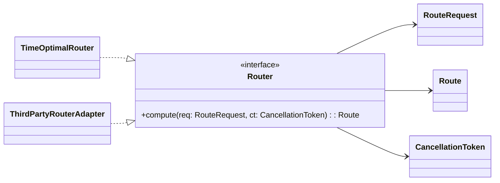
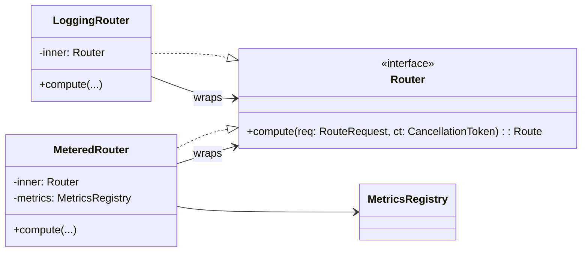
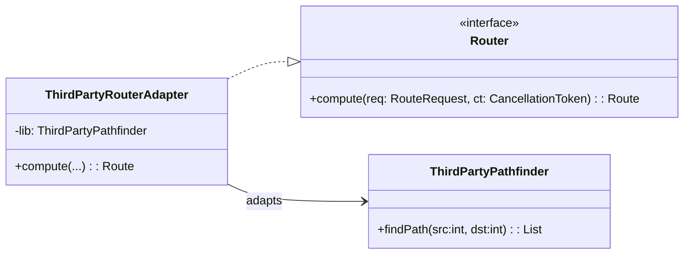
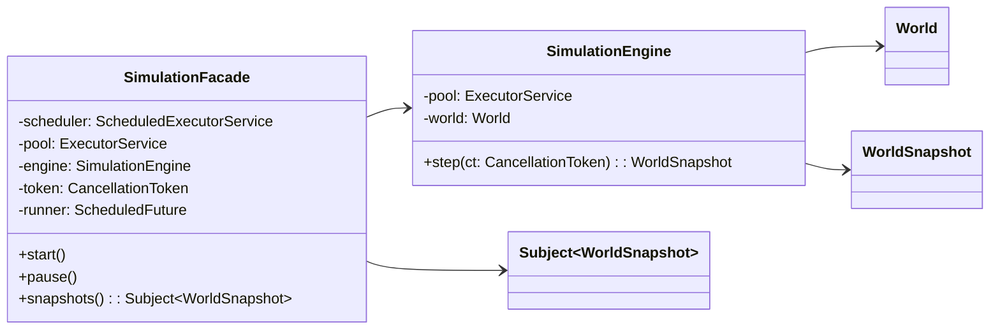
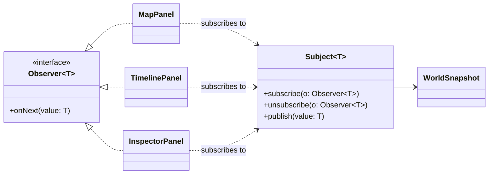
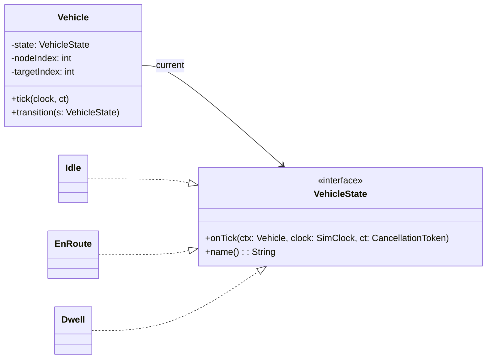
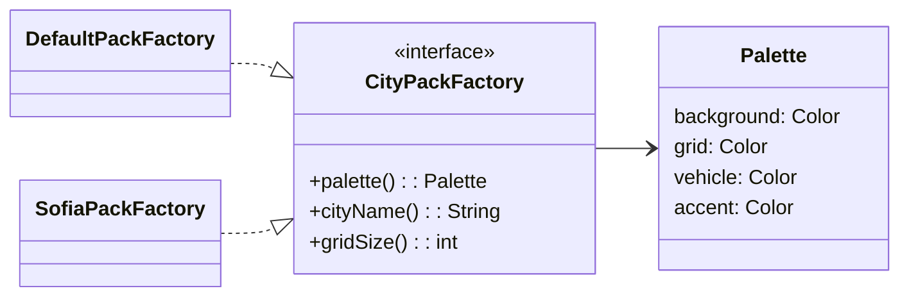
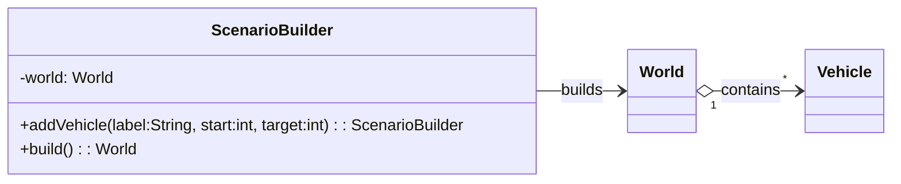
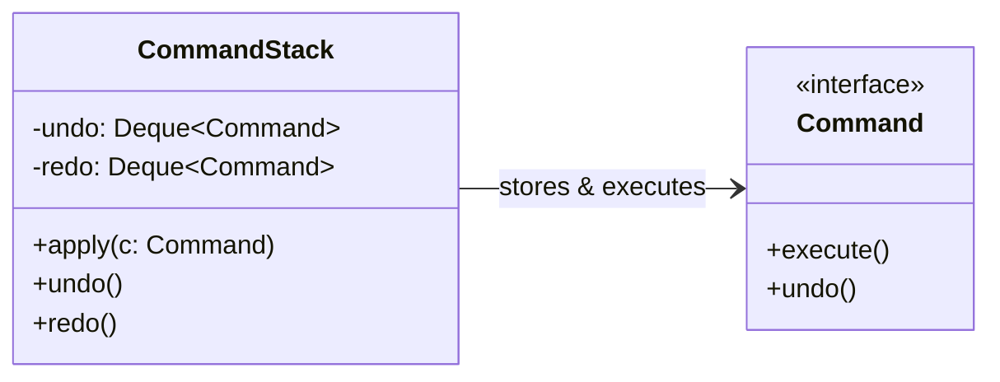
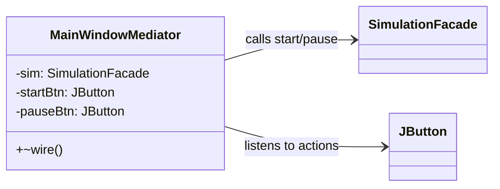

# 🧭 Описание на задачата  
### MetroSim: Симулатор на транспортна мрежа с паралелна обработка (Swing, Java 17)

---

## 🎯 Общ преглед

**MetroSim** е десктоп симулатор на транспортна мрежа, който визуализира движението на превозни средства в опростена метро/автобусна система.  
Проектът показва как множество **шаблони за проектиране (Design Patterns)** могат да бъдат комбинирани в **паралелно, събитийно и разширяемо приложение**, изградено със **Java Swing**.

Целта е приложението да служи като **примерна имплементация** за университетски курсове по:

- **Шаблони за проектиране (Design Patterns)** – демонстрирайки как различни шаблони се комбинират в обща архитектура.  
- **Паралелно програмиране** – демонстрация на безопасна работа с нишки и конкурентност в графични приложения.  

> 🧩 Приложението използва **Java Swing** за визуализация и **Executor-базирана паралелизация** за симулационното ядро.

---

## 🧠 Задача

Да се реализира симулатор на транспортна мрежа (метро), в който няколко превозни средства се движат по предварително зададени маршрути.  

Всяко превозно средство:
- стартира от определен възел (позиция);
- се придвижва стъпка по стъпка към крайната си точка;
- при достигане спира за кратък престой („dwell“), след което обръща посоката;
- се движи **едновременно** с останалите превозни средства.

Системата трябва да:
- поддържа вътрешен **симулационен часовник**;
- позволява управление чрез бутони **Start / Pause**;
- актуализира графичния интерфейс в реално време без да блокира Event Dispatch Thread (EDT);
- бъде **лесно разширяема** за нови теми, алгоритми за маршрутизиране и сценарии.

---

## 🧩 Архитектура на системата

| Слой | Описание |
|------|-----------|
| [**app/**](https://github.com/Alex-Tsvetanov/MetroSim/tree/main/src/main/java/metrosim/app) | Главна точка на стартиране и инициализация ([`Bootstrap.java`](https://github.com/Alex-Tsvetanov/MetroSim/blob/main/src/main/java/metrosim/app/Bootstrap.java), [`MetroSimApp.java`](https://github.com/Alex-Tsvetanov/MetroSim/blob/main/src/main/java/metrosim/app/MetroSimApp.java)). |
| [**ui/**](https://github.com/Alex-Tsvetanov/MetroSim/tree/main/src/main/java/metrosim/ui) | Графичен интерфейс (Swing) – [`MainWindow.java`](https://github.com/Alex-Tsvetanov/MetroSim/blob/main/src/main/java/metrosim/ui/MainWindow.java), панели и медиатор. |
| [**domain/**](https://github.com/Alex-Tsvetanov/MetroSim/tree/main/src/main/java/metrosim/domain) | Основна симулационна логика (свят, превозни средства, състояния, снимки). |
| [**infrastructure/**](https://github.com/Alex-Tsvetanov/MetroSim/tree/main/src/main/java/metrosim/infrastructure) | Конкурентен двигател ([`SimulationEngine.java`](https://github.com/Alex-Tsvetanov/MetroSim/blob/main/src/main/java/metrosim/infrastructure/SimulationEngine.java)) и фасада ([`SimulationFacade.java`](https://github.com/Alex-Tsvetanov/MetroSim/blob/main/src/main/java/metrosim/infrastructure/SimulationFacade.java)). |
| [**services/**](https://github.com/Alex-Tsvetanov/MetroSim/tree/main/src/main/java/metrosim/services) | Алгоритми за маршрутизиране, зареждане на сценарии и плъгини. |
| [**metrics/**](https://github.com/Alex-Tsvetanov/MetroSim/tree/main/src/main/java/metrosim/metrics) | Лека система за измервания и статистики (използвана от декоратори). |
| [**themes/**](https://github.com/Alex-Tsvetanov/MetroSim/tree/main/src/main/java/metrosim/themes) | Теми и цветови пакети (Default, Sofia) чрез плъгини. |
| [**events/**](https://github.com/Alex-Tsvetanov/MetroSim/tree/main/src/main/java/metrosim/events) | Събитийна система (Observer) за обновяване на потребителския интерфейс. |

---

## ⚙️ Функционални изисквания

| Категория | Описание |
|------------|-----------|
| **Потребителски интерфейс** | Главен прозорец с бутони **Start / Pause**, карта, панел за инспекция и времева линия. |
| **Симулационно ядро** | Паралелен двигател, който генерира [`WorldSnapshot`](https://github.com/Alex-Tsvetanov/MetroSim/blob/main/src/main/java/metrosim/domain/WorldSnapshot.java) и го публикува към UI-то. |
| **Конкурентност** | Паралелна обработка на превозни средства чрез `ForkJoinPool`; контрол на изпълнението чрез `CancellationToken`. |
| **Разширяемост** | Зареждане на градски пакети чрез [Java ServiceLoader](https://docs.oracle.com/javase/8/docs/api/java/util/ServiceLoader.html). |
| **Метрики** | Измерване на време и брой операции чрез [`SimpleMetricsRegistry`](https://github.com/Alex-Tsvetanov/MetroSim/blob/main/src/main/java/metrosim/metrics/SimpleMetricsRegistry.java). |

---

## 🧩 Използвани шаблони за проектиране (Design Patterns)

| Категория | Шаблон | Имплементация |
|------------|---------|----------------|
| **Създаващи (Creational)** | [**Abstract Factory**](https://en.wikipedia.org/wiki/Abstract_factory_pattern) | [`CityPackFactory`](https://github.com/Alex-Tsvetanov/MetroSim/blob/main/src/main/java/metrosim/themes/CityPackFactory.java) – фабрика за теми и цветови палитри. |
|  | [**Builder**](https://en.wikipedia.org/wiki/Builder_pattern) | [`ScenarioBuilder`](https://github.com/Alex-Tsvetanov/MetroSim/blob/main/src/main/java/metrosim/services/scenario/ScenarioBuilder.java) – изгражда конфигурации на света. |
| **Структурни (Structural)** | [**Facade**](https://en.wikipedia.org/wiki/Facade_pattern) | [`SimulationFacade`](https://github.com/Alex-Tsvetanov/MetroSim/blob/main/src/main/java/metrosim/infrastructure/SimulationFacade.java) – скрива сложността на нишки и синхронизация. |
|  | [**Decorator**](https://en.wikipedia.org/wiki/Decorator_pattern) | [`MeteredRouter`](https://github.com/Alex-Tsvetanov/MetroSim/blob/main/src/main/java/metrosim/services/routing/MeteredRouter.java), [`LoggingRouter`](https://github.com/Alex-Tsvetanov/MetroSim/blob/main/src/main/java/metrosim/services/routing/LoggingRouter.java). |
|  | [**Adapter**](https://en.wikipedia.org/wiki/Adapter_pattern) | [`ThirdPartyRouterAdapter`](https://github.com/Alex-Tsvetanov/MetroSim/blob/main/src/main/java/metrosim/services/routing/ThirdPartyRouterAdapter.java) – адаптира външна библиотека за намиране на пътища. |
| **Поведенчески (Behavioral)** | [**Observer**](https://en.wikipedia.org/wiki/Observer_pattern) | [`Subject`](https://github.com/Alex-Tsvetanov/MetroSim/blob/main/src/main/java/metrosim/events/Subject.java) – публикува снимки на света към панелите. |
|  | [**State**](https://en.wikipedia.org/wiki/State_pattern) | [`Vehicle`](https://github.com/Alex-Tsvetanov/MetroSim/blob/main/src/main/java/metrosim/domain/Vehicle.java) – преминава през Idle → EnRoute → Dwell. |
|  | [**Strategy**](https://en.wikipedia.org/wiki/Strategy_pattern) | [`Router`](https://github.com/Alex-Tsvetanov/MetroSim/blob/main/src/main/java/metrosim/services/routing/Router.java) – дефинира взаимозаменяеми алгоритми за маршрутизиране. |
|  | [**Command + Memento**](https://en.wikipedia.org/wiki/Command_pattern) | [`CommandStack`](https://github.com/Alex-Tsvetanov/MetroSim/blob/main/src/main/java/metrosim/ui/commands/CommandStack.java) – осигурява undo/redo (планирано за бъдещи версии). |
|  | [**Mediator**](https://en.wikipedia.org/wiki/Mediator_pattern) | [`MainWindowMediator`](https://github.com/Alex-Tsvetanov/MetroSim/blob/main/src/main/java/metrosim/ui/MainWindowMediator.java) – координира взаимодействието между бутоните и симулацията. |

---

## 🧵 Модел на конкурентност

| Нишка | Отговорност |
|--------|--------------|
| **EDT (Swing)** | Графика и взаимодействие с потребителя. |
| **Симулационен планировчик** | Задейства цикъла на симулацията на всеки интервал. |
| **Работен пул** | Изпълнява обновленията на превозните средства паралелно. |

[`SimulationEngine`](https://github.com/Alex-Tsvetanov/MetroSim/blob/main/src/main/java/metrosim/infrastructure/SimulationEngine.java)  
[`SimulationFacade`](https://github.com/Alex-Tsvetanov/MetroSim/blob/main/src/main/java/metrosim/infrastructure/SimulationFacade.java)

---

## 🧮 Метрики и плъгини

- [`SimpleMetricsRegistry`](https://github.com/Alex-Tsvetanov/MetroSim/blob/main/src/main/java/metrosim/metrics/SimpleMetricsRegistry.java) – регистрира броячи и времена.  
- Зареждане на плъгини чрез [`META-INF/services/metrosim.themes.CityPackFactory`](https://github.com/Alex-Tsvetanov/MetroSim/blob/main/src/main/resources/META-INF/services/metrosim.themes.CityPackFactory).  
- Примерен плъгин: [`SofiaPackFactory`](https://github.com/Alex-Tsvetanov/MetroSim/blob/main/src/main/java/metrosim/themes/SofiaPackFactory.java).

---

## 🔄 Поток на симулацията

1. **Start** → извиква `SimulationFacade.start()` и стартира планировчика.  
2. **Engine tick** → `SimulationEngine.step()` обновява всички превозни средства.  
3. **Snapshot publish** → генерира се нов `WorldSnapshot`, който се публикува към UI.  
4. **UI repaint** → панелите визуализират състоянието асинхронно на EDT.  
5. **Pause** → `CancellationToken` прекъсва симулацията.  
6. **Restart** → токенът се ресетира и цикълът продължава.

---

## 🧪 Критерии за оценяване

| Критерий | Тежест |
|-----------|--------|
| Коректно прилагане на ≥6 GoF шаблона | 30% |
| Коректност на конкурентността и реактивността | 25% |
| Архитектура и четимост на кода | 20% |
| Разширяемост (плъгини, теми, маршрути) | 15% |
| Документация и обяснение на шаблоните | 10% |

---

## 🧱 Инструкции за изпълнение

```bash
# Компилиране и стартиране (изисква JDK 17)
./gradlew run

# Стартиране с алтернативна градска тема
./gradlew run -Dmetrosim.cityPack=sofia
```

## UML диаграми
<details>
<summary><b>Strategy</b></summary>


</details>

<details>
<summary><b>Decorator</b></summary>


</details>
<details>
<summary><b>Adapter</b></summary>


</details>
<details>
<summary><b>Facade</b></summary>


</details>
<details>
<summary><b>Observer</b></summary>


</details>
<details>
<summary><b>State</b></summary>


</details>
<details>
<summary><b>Abstract Factory</b></summary>


</details>
<details>
<summary><b>Builder</b></summary>


</details>
<details>
<summary><b>Command + Memento</b></summary>


</details>
<details>
<summary><b>Mediator</b></summary>


</details>

# 🧭 Project Task Description  
### MetroSim: Concurrent Transit Network Simulator (Swing, Java 17)

---

## 🎯 Overview

**MetroSim** is a desktop **transit network simulator** that visualizes vehicles moving through a simplified metro or bus system.  
It demonstrates how **multiple GoF design patterns** can be combined in a **parallel, event-driven Swing application** to achieve scalability, modularity, and maintainability.

The project serves as a **reference implementation** for university courses in:

- **Design Patterns** – showing how patterns interact in a cohesive architecture.  
- **Parallel Programming** – demonstrating safe concurrency in GUI applications.  

> 🧩 The application uses **Java Swing** for the UI and **Executor-based concurrency** for the simulation core.

---

## 🧠 Problem Statement

Implement a simulator for a metro network where multiple vehicles move along virtual routes.  
Each vehicle:
- Starts at a specified node.
- Moves step-by-step toward its destination.
- Waits (“dwells”) briefly upon arrival, then reverses direction.
- Operates concurrently with all other vehicles.

The system must:
- Continuously advance a **simulation clock**.
- Allow **Start** / **Pause** control of the simulation.
- Update the Swing UI in real time without blocking the Event Dispatch Thread.
- Maintain high extensibility for future features such as new cities, routers, or event visualizations.

---

## 🧩 Architecture Overview

| Layer | Description |
|-------|--------------|
| [**app/**](https://github.com/Alex-Tsvetanov/MetroSim/tree/main/src/main/java/metrosim/app) | Entry point and dependency composition ([`Bootstrap.java`](https://github.com/Alex-Tsvetanov/MetroSim/blob/main/src/main/java/metrosim/app/Bootstrap.java), [`MetroSimApp.java`](https://github.com/Alex-Tsvetanov/MetroSim/blob/main/src/main/java/metrosim/app/MetroSimApp.java)). |
| [**ui/**](https://github.com/Alex-Tsvetanov/MetroSim/tree/main/src/main/java/metrosim/ui) | Swing GUI components ([`MainWindow.java`](https://github.com/Alex-Tsvetanov/MetroSim/blob/main/src/main/java/metrosim/ui/MainWindow.java)), panels, and mediator. |
| [**domain/**](https://github.com/Alex-Tsvetanov/MetroSim/tree/main/src/main/java/metrosim/domain) | Core simulation model (world, vehicles, states, snapshots). |
| [**infrastructure/**](https://github.com/Alex-Tsvetanov/MetroSim/tree/main/src/main/java/metrosim/infrastructure) | Concurrent engine ([`SimulationEngine.java`](https://github.com/Alex-Tsvetanov/MetroSim/blob/main/src/main/java/metrosim/infrastructure/SimulationEngine.java)) and facade ([`SimulationFacade.java`](https://github.com/Alex-Tsvetanov/MetroSim/blob/main/src/main/java/metrosim/infrastructure/SimulationFacade.java)). |
| [**services/**](https://github.com/Alex-Tsvetanov/MetroSim/tree/main/src/main/java/metrosim/services) | Routing, scenario loading, and plugins. |
| [**metrics/**](https://github.com/Alex-Tsvetanov/MetroSim/tree/main/src/main/java/metrosim/metrics) | Lightweight performance counters (Decorator target). |
| [**themes/**](https://github.com/Alex-Tsvetanov/MetroSim/tree/main/src/main/java/metrosim/themes) | Theme factories and plugin examples (Default, Sofia). |
| [**events/**](https://github.com/Alex-Tsvetanov/MetroSim/tree/main/src/main/java/metrosim/events) | Observer/event system for decoupled updates. |

---

## 🧩 Key Features

- **Real-time simulation** of vehicles and world clock.
- **Responsive Swing UI** — updates through immutable `WorldSnapshot`s.
- **Thread-safe parallelism** using `ForkJoinPool` and `ScheduledExecutorService`.
- **Extensible design** — new routers, cities, or metrics via plugins.
- **Command pattern scaffold** for future editing / undo-redo operations.

---

## ⚙️ Functional Requirements

| Category | Description |
|-----------|--------------|
| **User Interface** | Swing main window with Start / Pause controls, map, timeline, and inspector panels. |
| **Simulation Core** | Background engine advancing ticks and publishing [`WorldSnapshot`](https://github.com/Alex-Tsvetanov/MetroSim/blob/main/src/main/java/metrosim/domain/WorldSnapshot.java). |
| **Concurrency** | Parallel vehicle updates using a work-stealing thread pool; cancellable execution tokens. |
| **Extensibility** | City themes discovered via [Java ServiceLoader](https://docs.oracle.com/javase/8/docs/api/java/util/ServiceLoader.html). |
| **Metrics** | Performance counters via [`SimpleMetricsRegistry`](https://github.com/Alex-Tsvetanov/MetroSim/blob/main/src/main/java/metrosim/metrics/SimpleMetricsRegistry.java). |

---

## 🧩 Design Patterns Used

| Category | Pattern | Implementation |
|-----------|----------|----------------|
| **Creational** | [**Abstract Factory**](https://en.wikipedia.org/wiki/Abstract_factory_pattern) | [`CityPackFactory`](https://github.com/Alex-Tsvetanov/MetroSim/blob/main/src/main/java/metrosim/themes/CityPackFactory.java) for visual themes (Default, Sofia). |
|  | [**Builder**](https://en.wikipedia.org/wiki/Builder_pattern) | [`ScenarioBuilder`](https://github.com/Alex-Tsvetanov/MetroSim/blob/main/src/main/java/metrosim/services/scenario/ScenarioBuilder.java) constructs world configurations. |
| **Structural** | [**Facade**](https://en.wikipedia.org/wiki/Facade_pattern) | [`SimulationFacade`](https://github.com/Alex-Tsvetanov/MetroSim/blob/main/src/main/java/metrosim/infrastructure/SimulationFacade.java) hides concurrency and scheduling logic. |
|  | [**Decorator**](https://en.wikipedia.org/wiki/Decorator_pattern) | [`MeteredRouter`](https://github.com/Alex-Tsvetanov/MetroSim/blob/main/src/main/java/metrosim/services/routing/MeteredRouter.java), [`LoggingRouter`](https://github.com/Alex-Tsvetanov/MetroSim/blob/main/src/main/java/metrosim/services/routing/LoggingRouter.java). |
|  | [**Adapter**](https://en.wikipedia.org/wiki/Adapter_pattern) | [`ThirdPartyRouterAdapter`](https://github.com/Alex-Tsvetanov/MetroSim/blob/main/src/main/java/metrosim/services/routing/ThirdPartyRouterAdapter.java) wraps an incompatible pathfinding API. |
| **Behavioral** | [**Observer**](https://en.wikipedia.org/wiki/Observer_pattern) | [`Subject`](https://github.com/Alex-Tsvetanov/MetroSim/blob/main/src/main/java/metrosim/events/Subject.java) publishes snapshots to UI observers. |
|  | [**State**](https://en.wikipedia.org/wiki/State_pattern) | [`Vehicle`](https://github.com/Alex-Tsvetanov/MetroSim/blob/main/src/main/java/metrosim/domain/Vehicle.java) transitions between Idle → EnRoute → Dwell. |
|  | [**Strategy**](https://en.wikipedia.org/wiki/Strategy_pattern) | [`Router`](https://github.com/Alex-Tsvetanov/MetroSim/blob/main/src/main/java/metrosim/services/routing/Router.java) defines pluggable routing strategies. |
|  | [**Command + Memento**](https://en.wikipedia.org/wiki/Command_pattern) | [`CommandStack`](https://github.com/Alex-Tsvetanov/MetroSim/blob/main/src/main/java/metrosim/ui/commands/CommandStack.java) enables undo/redo (future editor). |
|  | [**Mediator**](https://en.wikipedia.org/wiki/Mediator_pattern) | [`MainWindowMediator`](https://github.com/Alex-Tsvetanov/MetroSim/blob/main/src/main/java/metrosim/ui/MainWindowMediator.java) coordinates button actions. |

---

## 🧵 Concurrency Model

| Thread | Responsibility |
|--------|----------------|
| **EDT (Swing)** | Handles rendering and user interaction. |
| **Simulation Scheduler** | Periodically triggers simulation ticks. |
| **Worker Pool** | Executes per-vehicle updates and routing in parallel. |

> Snapshots are immutable, ensuring **no data races** between simulation threads and the Swing Event Dispatch Thread.

[`SimulationEngine`](https://github.com/Alex-Tsvetanov/MetroSim/blob/main/src/main/java/metrosim/infrastructure/SimulationEngine.java)  
[`SimulationFacade`](https://github.com/Alex-Tsvetanov/MetroSim/blob/main/src/main/java/metrosim/infrastructure/SimulationFacade.java)

---

## 🧮 Metrics and Plugins

- [`SimpleMetricsRegistry`](https://github.com/Alex-Tsvetanov/MetroSim/blob/main/src/main/java/metrosim/metrics/SimpleMetricsRegistry.java) tracks counters and durations.  
- Plugins discovered via [`META-INF/services/metrosim.themes.CityPackFactory`](https://github.com/Alex-Tsvetanov/MetroSim/blob/main/src/main/resources/META-INF/services/metrosim.themes.CityPackFactory).  
- Example plugin: [`SofiaPackFactory`](https://github.com/Alex-Tsvetanov/MetroSim/blob/main/src/main/java/metrosim/themes/SofiaPackFactory.java).

---

## 🧩 Simulation Flow

1. **Start** → `SimulationFacade.start()` schedules periodic ticks.  
2. **Engine tick** → `SimulationEngine.step()` updates each `Vehicle` concurrently.  
3. **Snapshot publish** → New `WorldSnapshot` broadcast via `Subject`.  
4. **UI repaint** → Panels render snapshot asynchronously on EDT.  
5. **Pause** → `CancellationToken` cooperatively stops tasks.  
6. **Restart** → Token resets; scheduler resumes (safe resume after pause).

---

## 🧪 Evaluation Criteria

| Aspect | Weight |
|--------|--------|
| Correct application of ≥6 GoF patterns | 30% |
| Concurrency correctness & responsiveness | 25% |
| Clean architecture & code organization | 20% |
| Extensibility (plugins, routers, cities) | 15% |
| Documentation and clarity | 10% |

---

## 🧱 Run Instructions

```bash
# Build and run (requires JDK 17)
./gradlew run

# Run with alternative city pack
./gradlew run -Dmetrosim.cityPack=sofia
```